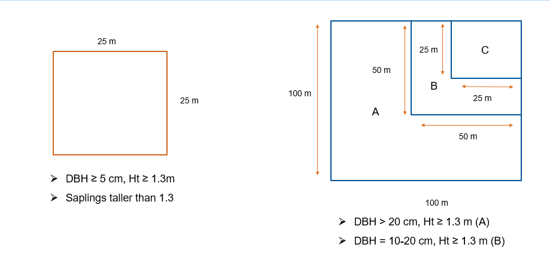

---
output:
  html_document: default
  pdf_document: default
---

```{r setup, include=FALSE}
knitr::opts_chunk$set(echo = TRUE)
```

##### Carbon stocks assessment wkgfgerklrltgith National Forest Inventories Data

**Loading the required Packages**

```{r, message=FALSE}
library(tidyverse)
library(dplyr)
library(ggplot2)
library(stringr)
library(maps)
library(mapdata)
library(maptools)
library(sp)
library(raster)
library(BIOMASS)
library(ape)
library(magrittr)
library(tinytex)
library(raster)
library(rgdal)
```
**load the dataframe**

```{r}
Trees <- read.csv("Data_Output/Final_dataframe(29-10-2019).csv", stringsAsFactors = F)
str(Trees)
```


**Obtaining wood density**

Obtaining Wood density - getWoodDensity assigns to each taxon a species- or genus-level average if at least one wood density value in the same genus as the focal taxon is available in the reference database. For unidentified trees or if the genus is missing in the reference database, the stand-level mean wood density is assigned to the tree (based on trees for which a value was attributed).

```{r, message=FALSE}
Taxo <- correctTaxo(genus= Trees$Genus, species = Trees$Species)
Trees$genusCorr <- Taxo$genusCorrected
Trees$speciesCorr <- Taxo$speciesCorrected

APG <- getTaxonomy(Trees$genusCorr, findOrder =T)

Trees$familyAPG <- APG$family

Trees$orderAPG <- APG$order
dataWD <- getWoodDensity(genus=Trees$genusCorr,
                         species=Trees$speciesCorr,
                         stand=NULL, family = Trees$familyAPG, region = "World")

Trees <- Trees %>% mutate(DBH_cm=DBH_mm/10) %>% mutate(WD=dataWD$meanWD)

```

**Building a Diameter Height Model based on the first year data**

```{r, message=FALSE}
library(lme4)
Forests <- read.csv("Data/All_data_Final.csv", stringsAsFactors = F)
names(Forests)
Forests <- filter(Forests,!is.na(Species_names) & !is.na(Dbh_cm))
summary(Forests)
unique(Forests$Forest_type)
Selected_Forests <- Forests %>% filter(Forest_type=="Moist_Mixed_Deciduous_Forest"| Forest_type=="Dry_Mixed_Deciduous_Forest")
LogDH_Selected_Forests <- Selected_Forests %>% mutate(LogDbh_cm=log(Dbh_cm)) %>% mutate(LogH_m=log(H_m))
ggplot(data = Selected_Forests, aes(Dbh_cm, H_m, color=Forest_type) )+ geom_point()
ModelForHeight <- lmer(log(H_m)~log(Dbh_cm)+(1|Plot_id), REML = FALSE, data = Selected_Forests)
ModelForHeight
ranef(ModelForHeight)$Plot_id[,1] %>% hist()

ModelForHeight_Log <- lmer(LogH_m~LogDbh_cm +(1|Plot_id), REML = FALSE, data = LogDH_Selected_Forests)
ModelForHeight_Log
```
__**The best possible random effect model**__

```{r}
summary(ModelForHeight_Log)
ranef(ModelForHeight_Log)$Plot_id[,1] %>% hist()
```
Getting tree Height based on the best model and substracted the lowest random effect of the plot no. 115 from every plots of the dataframe that I need to predict Height. Plot no. 115 had the lowest random effect number.

```{r}
Trees$H_pred <- predict(ModelForHeight_Log, data.frame(LogDbh_cm= log(Trees$DBH_cm), Plot_id=115))
Trees <- Trees %>%
  mutate(AdjustH_Pred=exp(H_pred))
```
Testing the DBH and Height relationship for trees-----

```{r}
ggplot(data = Trees, aes(DBH_cm, AdjustH_Pred) )+ geom_point()
```

**_Calculating the biomass of each tree_**

Where, D = Tree diameter (in cm), either a vector or a single value
Wood density (in g/cm3), either a vector or a single value.
Tree height (H in m), either a vector or a single value.

```{r, message=FALSE}
CoordsH <- cbind(Trees$EAST, Trees$NORTH)
Trees <- Trees %>% mutate(AGB=computeAGB(D = DBH_cm, WD = WD, H = AdjustH_Pred, coord = CoordsH, Dlim = NULL))
Trees <- Trees %>% mutate(Carbon_Mg= AGB*0.471)
write.csv(Trees, file = "Data_Output/Trees.csv", row.names = F)
```

**Sampling Method**

image: 

1 ha sample plot with a 50m * 50 m nested plot. Therefore, the big dataframe was splitted into two according to the DBH limit measured in the 50m * 50m  subplot. *(100m x 100m and 50m x 50m)*  

```{r}
Trees <- read.csv("Data_Output/Trees.csv", stringsAsFactors = F)
Trees <- droplevels(Trees)
Trees_1ha <- Trees %>% filter(DBH_mm >= 200)
Trees_50m <- Trees %>% filter(DBH_mm < 200)
```

** Calculating the carbon per ha for two different size plots**  

```{r}
Plot_1ha <- Trees_1ha %>%
  group_by(Plot_names,DIST,Year, EAST, NORTH) %>%
  dplyr::summarise(C_ha = sum(Carbon_Mg))

Plot_50M <- Trees_50m %>%
  group_by(Plot_names,DIST,Year, EAST, NORTH) %>%
  dplyr::summarise(C_Tree_total = sum(Carbon_Mg)) %>%
  mutate(C_ha=C_Tree_total/0.25) %>% dplyr::select(-C_Tree_total)

```
Combining two dataframes of different plot size according to Plot names.In this process, *NA* values- generated were replaced with zero in order to add carbon per ha of different plot size together. Carbon per hectare columns of the two dataframes were added together to obtain total carbon of each plot in hectare scale. 

```{r}
All_Plots <- bind_rows(Plot_1ha,Plot_50M) %>% group_by(Plot_names,Year,DIST,EAST, NORTH) %>% summarise(Sum_CHa=sum(C_ha))
droplevels(All_Plots)

```


```{r}

hist(All_Plots$Sum_CHa, breaks=100)

```

**Producing a clean dataframe**

```{r}
All_Plots$Year <- as.factor(All_Plots$Year)
summary(All_Plots)
write.csv(All_Plots, file = "Data_Output/All_plots.csv", row.names = F)
```
```{r}
ggplot(data = All_Plots, aes(x = DIST, y= log(Sum_CHa), color= Year))+ 
  geom_boxplot()+
  labs(title = "Carbon storage per ha in 21 disctricts from 2010 to 2017", 
       x= "District name",
       y= "Carbon(t/ha)")+
  theme(axis.text.x = element_text(size=7, angle = 90, vjust = 0.5),
        axis.text.y = element_text(size = 7))

```

This section describes how the plots' location errors were fixed. All plots' locations were plotted according to 46 Q and 47 Q CRS. Then, plots located in 46 Q zone and 47 Q zone were sliced from the main dataframe. The remaining plots wich were outside of the country boundry were thoroughly checked for theirs north and east location. It found that North and East were the other way wrong. So, I renamed East to North and North to East.After that, most of the plots are back in the country boundary area.However, some plots were still in the wrong positions. So, I had to slice the edited 46 and 47 Out dataframes as 46 Adjusted and 47 Adjusted (which are the plots that have to be shifted from their position as they were in the paddy fieds instead of being in the forest). The closet plots which are in the right position were referenced to move the wrong plots. (E.g checked the right plot's North and East and possible typo errors such as 9 to 5 or flipping the numbers front to back and back to front). Then, the adjusted 46Q plots and 47Q plots were joined back to the 46Out and 47Out dataframe to obtain the total plots numbers that have been fixed for the right locations by using r bind funciton. Then the corrected plots locations dataframe was joined with the carbon-per-plot dataframe which has the wrong North and East by excluding them based on the plots_names. Finally, the dataframe which as the right plot locations and carbon per plot was created. Based on the final plot_carbon dataframe, shape file of the plot locations(edited) was produced. This shape file will be used to extract the remotely sensed data from the Google Earth Engine. 


```{r}
library(tidyverse)
library(dplyr)
library(ggplot2)
library(stringr)
library(maps)
library(mapdata)
library(maptools)
library(sp)
library(raster)
library(BIOMASS)
library(ape)
library(magrittr)
library(tinytex)
library(raster)
library(rgdal)

In_46 <- read.csv("Data_Output/Qgis_edited_Plots_Locations and Carbon/In_Plots46.csv",stringsAsFactors = F)
In_47 <- read.csv("Data_Output/Qgis_edited_Plots_Locations and Carbon/In_Plots47.csv",stringsAsFactors = F)
Out_47 <- read.csv("Data_Output/Qgis_edited_Plots_Locations and Carbon/Out_47.csv", stringsAsFactors = F)
Out_46 <- read.csv("Data_Output/Qgis_edited_Plots_Locations and Carbon/Out_46.csv", stringsAsFactors = F)
Out_46Adjusted <- read.csv("Data_Output/Qgis_edited_Plots_Locations and Carbon/46 Adjusted.csv", stringsAsFactors = F)
Out_47Adjusted <- read.csv("Data_Output/Qgis_edited_Plots_Locations and Carbon/47 Adjusted.csv",stringsAsFactors = F)


Out46RowToBeRemoved <- Out_46Adjusted$Plot_names
Cleaned_Out46 <- Out_46[-which(Out_46$Plot_names %in% Out46RowToBeRemoved),]
New_Out46 <- rbind(Cleaned_Out46,Out_46Adjusted)                  
                  

Out47RowToBeRemoved <- Out_47Adjusted$Plot_names
Cleaned_Out47 <- Out_47[-which(Out_47$Plot_names %in% Out47RowToBeRemoved),]
New_Out47 <- rbind(Cleaned_Out47,Out_47Adjusted)   
   

Lcorrected_Plots <- rbind(In_46,In_47,New_Out46, New_Out47)
Carbon <- read.csv("Data_Output/All_plots.csv", stringsAsFactors = F)
Carbon <- Carbon %>% dplyr::select(Plot_names,Sum_CHa)
Plot_Carbon <- left_join(Lcorrected_Plots,Carbon, by="Plot_names")


str(Plot_Carbon)

summary(Plot_Carbon)

world2HiresMapEnv

data(wrld_simpl)
myanmar <- wrld_simpl[wrld_simpl$NAME=="Burma",]
plot(myanmar)
myanmar_utm46 <- spTransform(myanmar, "+init=epsg:32646")
myanmar_utm47 <- spTransform(myanmar, "+init=epsg:32647")
plot(myanmar_utm47)
plot(myanmar_utm46)
# Loading the known plots and add a colum called Zone (46/47)----

coords46 <- Plot_Carbon %>% 
  filter(Zone==46)

coords47 <-Plot_Carbon %>% 
  filter(Zone ==47) 


coords46 = SpatialPoints(cbind(coords46$EAST, coords46$NORTH))
proj4string(coords46) = CRS("+init=epsg:32646")
coords46<-spTransform(coords46, "+init=epsg:4326")

coords47 = SpatialPoints(cbind(coords47$EAST, coords47$NORTH))
proj4string(coords47) = CRS("+init=epsg:32647")
coords47<-spTransform(coords47, "+init=epsg:4326")

par(mar=c(4,4,2,2), mfrow =c(2,2))
plot(myanmar, border = "red")
plot(coords46, add = TRUE, cex = 0.1, col = "blue")
plot(coords47, add= TRUE, cex = 0.1, col = "green")

Plot_Carbon$Year <- as.factor(Plot_Carbon$Year)
ggplot(data = Plot_Carbon, aes(x = DIST, y= log(Sum_CHa), color= Year))+ 
  geom_boxplot()+
  labs(title = "Carbon storage per ha in 21 disctricts from 2010 to 2017", 
       x= "District name",
       y= "Carbon(t/ha)")+
  theme(axis.text.x = element_text(size=7, angle = 90, vjust = 0.5),
        axis.text.y = element_text(size = 7))

glm.CarbonDistrict <- glm(log(Sum_CHa)~DIST, data = Plot_Carbon, family= gaussian(link="identity") )
anova(glm.CarbonDistrict)
plot(glm.CarbonDistrict)
summary(glm.CarbonDistrict)

Grid46 <- Plot_Carbon %>% filter(Zone=="46")

Grid47 <- Plot_Carbon %>% filter(Zone=="47")

coords46 = SpatialPoints(cbind(Grid46$EAST, Grid46$NORTH))
proj4string(coords46) = CRS("+init=epsg:32646")
coords46 <- spTransform(coords46, "+init=epsg:4326")

coords47 = SpatialPoints(cbind(Grid47$EAST, Grid47$NORTH))
proj4string(coords47) = CRS("+init=epsg:32647")
coords47 <- spTransform(coords47, "+init=epsg:4326")

Plots_location <- rbind(coords46,coords47) 

spdf = SpatialPointsDataFrame(Plots_location,data = Plot_Carbon)

writeOGR(spdf,"locations_WGS84Edited.shp", layer="plot_locations", driver = "ESRI Shapefile")


```

This section describes how carbon storage of all the plots are different according to the ecoregions published by WWF.The plot locations shape file and ecoregion shape files ware used with QGIS to extract which plots belong to which ecoregions. The function called "Join attributed by locations " was used in this process. 

```{r}
Ecoregions <- read.csv("Data_Output/Ecoregion-Plots-Edited(31-10-2019).csv", stringsAsFactors = F)
glm.CarbonEcoregions <- glm(log(Sum_CHa)~ECO_NAME, data = Ecoregions, family = gaussian(link = "identity"))
anova(glm.CarbonEcoregions)
plot(glm.CarbonEcoregions)
summary(glm.CarbonEcoregions)
```
```{r}
boxplot(log(Sum_CHa)~ECO_NAME, data = Ecoregions)
aov.CarbonEcoregions <- aov(Sum_CHa~ECO_NAME, data = Ecoregions)
summary(aov.CarbonEcoregions)

ggplot(data=Ecoregions, aes(x=ECO_NAME, y = log(Sum_CHa), color=ECO_NAME))+ geom_boxplot()+
  labs(title = "Carbon storage according to ecoregions", 
       x= "Ecoregion",
       y= "MaxCarbon(t/ha)")+
  theme(axis.text.x = element_text(size=7, angle = 90, vjust = 0.5),
        axis.text.y = element_text(size = 7))

```


**Carbon and environmental conditions relationship** 

BIO1 = Annual Mean Temperature  
BIO2 = Mean Diurnal Range (Mean of monthly (max temp - min temp))  
BIO3 = Isothermality (BIO2/BIO7) (* 100)  
BIO4 = Temperature Seasonality (standard deviation *100)  
BIO5 = Max Temperature of Warmest Month  
BIO6 = Min Temperature of Coldest Month  
BIO7 = Temperature Annual Range (BIO5-BIO6)  
BIO8 = Mean Temperature of Wettest Quarter  
BIO9 = Mean Temperature of Driest Quarter  
BIO10 = Mean Temperature of Warmest Quarter  
BIO11 = Mean Temperature of Coldest Quarter  
BIO12 = Annual Precipitation  
BIO13 = Precipitation of Wettest Month  
BIO14 = Precipitation of Driest Month  
BIO15 = Precipitation Seasonality (Coefficient of Variation)  
BIO16 = Precipitation of Wettest Quarter  
BIO17 = Precipitation of Driest Quarter  
BIO18 = Precipitation of Warmest Quarter  
BIO19 = Precipitation of Coldest Quarter  

I performed a simple liner regression analysis on the two variables Carbon and Annual precipitaion(AP)/Annual Mean Temperature(AMT). I wish to determine wheter the AP/AMT varible is a significant predictor of the Carbon Variable.

```{r}
Env <- read.csv("Data_Output/WCL_plots_edited(31-10-2019).csv")

```

```{r}
plot(Sum_CHa~bio01, data = Env)
glm.AMT <- glm(log(Sum_CHa)~bio01,data=Env, family = gaussian(link = "identity"))
summary(glm.AMT)
plot(glm.AMT)

# According to Year 
ggplot(data=Env, aes(x=log(bio01), y = log(Sum_CHa), color=DIST))+ geom_line()+
  facet_wrap(facets = vars(Year))+
  labs(title = "Carbon storage and Annual Mean Temperature Relationship according to Census Year", 
       x= "Log Annual Mean Temperature",
       y= "Log Carbon(t/ha)")+
  theme(axis.text.x = element_text(size=7, angle = 45, vjust = 0.5),
        axis.text.y = element_text(size = 7))
```

```{r}
plot(log(Sum_CHa)~bio12, data = Env)
glm.AMP <- glm(log(Sum_CHa)~bio12, data=Env, family = gaussian(link = "identity"))
anova(glm.AMP)
summary(glm.AMP)


ggplot(data=Env, aes(x=bio12, y = log(Sum_CHa), color=DIST))+ geom_point(alpha=1/5)+
  labs(title = "Carbon storage and Annual Precipitation Relationship", 
       x= "Annual Annual Precipitation (mm)",
       y= "Carbon(t/ha)")+
```


```{r}
theme(axis.text.x = element_text(size=7, angle = 45, vjust = 0.5),
        axis.text.y = element_text(size = 7))

# According to Year 
ggplot(data=Env, aes(x=bio12, y = log(Sum_CHa), color=DIST))+ geom_line()+
  # facet_wrap(facets = vars(DIST))+
  labs(title = "Carbon storage and Annual Precipitation (mm) Relationship According to Census Year", 
       x= "Annual Precipitation (mm)",
       y= "Carbon(t/ha)")+
  theme(axis.text.x = element_text(size=7, angle = 90, vjust = 0.5),
        axis.text.y = element_text(size = 7))
```


```{r}
n<-10000

rsq<-vector(n, mode = 'numeric')
pval<-vector(n, mode = 'numeric')
for(i in 1:n){
  
x<-rnorm(100)
y<-rnorm(100)

fm<-lm(y~x)

fm_sum<-summary(fm)
rsq[[i]]<-fm_sum$r.squared
pval[[i]]<-fm_sum$coefficients[2,4]
}

hist(rsq, breaks = 100)
hist(pval, breaks = 100)

(sum(pval<0.05) / length(pval))*100


```


