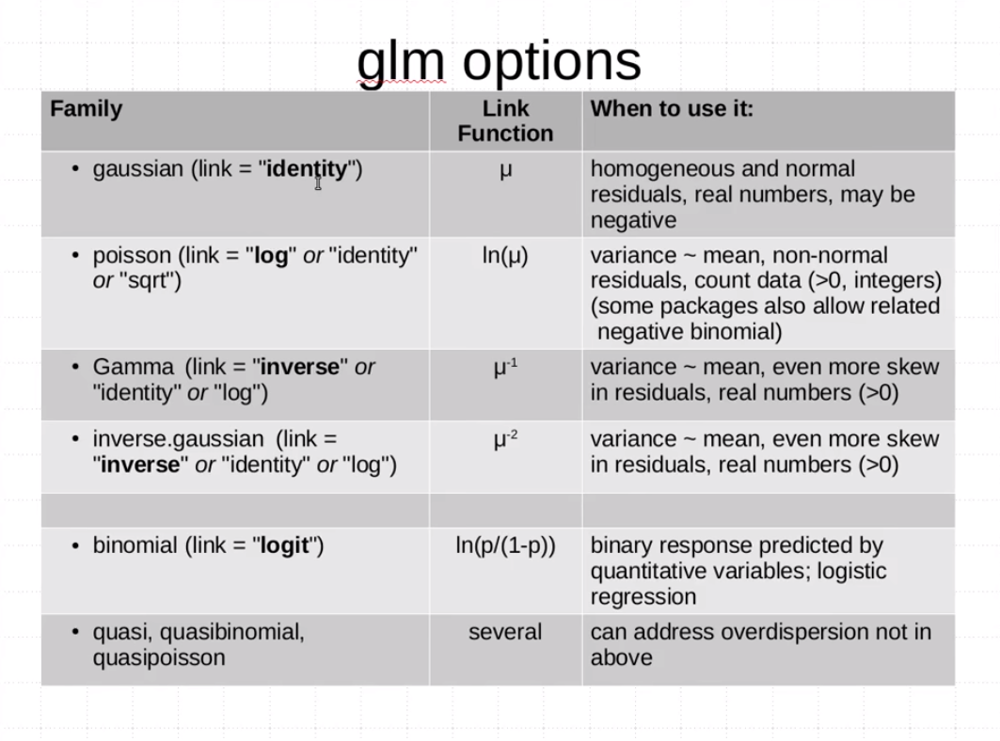
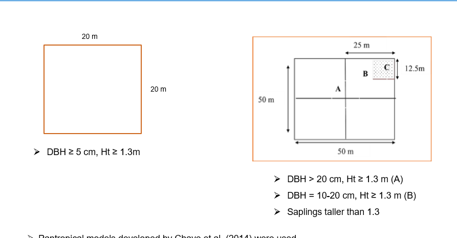

```{r}
library(tidyverse)
library(lubridate)
library(BIOMASS)
library(ape)
library(ggplot2)
library(tidyverse)
library(dplyr)
library(ggplot2)
library(stringr)
library(maps)
library(mapdata)
library(maptools)
library(sp)
library(raster)
library(BIOMASS)
library(ape)
library(magrittr)
library(tinytex)
library(raster)
library(rgdal)
library(measurements)
library(lme4)
library(bbmle)
```

```{r}
Field_Data <- read.csv("Data/Popa_Fieldwork/Popa_Fieldwork(23-10-2019).csv", stringsAsFactors = F)


Field_Data <- Field_Data %>%
    mutate(Forest_type = case_when(Plot >= 14 ~ 'Evergreen_Forest',
                                  Plot >= 7 ~ 'Moist_Mixed_Deciduous_Forest',
                                  Plot >= 4 ~ 'Dry_Mixed_Deciduous_Forest',
                                  Plot >= 1 ~ 'Dry_Forest'
                                  ))
```

**Checking typos in taxonomy**

```{r}
Taxo <- correctTaxo(genus=Field_Data$Genus, species = Field_Data$Species)
Field_Data$genusCorr <- Taxo$genusCorrected
Field_Data$speciesCorr <- Taxo$speciesCorrected
```
**Retrieving APG III Families and Orders from Genus names**

```{r}
APG <- getTaxonomy(Field_Data$genusCorr, findOrder = T)
Field_Data$familyAPG <- APG$family
Field_Data$orderAPG <- APG$order
```

**RETRIEVE WOOD DENSITY**

```{r}
dataWD <- getWoodDensity(genus=as.character(Field_Data$genusCorr),
                         species=as.character(Field_Data$speciesCorr),
                         stand=Field_Data$Plot)
```


```{r}
sum(dataWD$levelWD == "species")

sum(dataWD$levelWD == "genus")

sum(!dataWD$levelWD%in%c("genus","species"))

Field_Data$WD <- dataWD$meanWD
str(Field_Data)
```

**Computing AGB**

```{r}
AGBtree<-computeAGB(D=Field_Data$DBH_cm,
                    WD=Field_Data$WD,
                    H = Field_Data$Height_m)
# Compute AGB(Mg) per tree----
Field_Data$AGB_Mg <- AGBtree

# Compute Carbon (Mg) per tree --
Field_Data <- Field_Data %>%
  mutate(Carbon_Mg= AGB_Mg*0.47) %>% mutate(C_Tree_Ha = Carbon_Mg/0.04)
str(Field_Data)
Field_Data$Plot <- factor(Field_Data$Plot)

boxplot(C_Tree_Ha~Plot, data=Field_Data)
summary(aov(C_Tree_Ha ~ factor(Plot), data = Field_Data))
 
Field_Carbon <- Field_Data %>%
  group_by(Plot, Forest_type) %>%
  dplyr::summarise(Total_C = sum(C_Tree_Ha), Elevation = mean(Elevation_m)) %>% rename(Plot_Number=Plot) %>% mutate(Year=paste(2019))

ggplot(data=Field_Carbon, aes(x=as.numeric(Plot_Number),y =Total_C, color=as.numeric(Plot_Number)))+ geom_point()+ geom_line()+
      labs(title = "Carbon storage in 20 Permanent sample plots", 
       x= "Plot",
       y= "Carbon(t/ha)")+
  theme(axis.text.x = element_text(size=7, angle = 0, vjust = 0.5),
        axis.text.y = element_text(size = 7))

ggplot(data=Field_Carbon, aes(x=as.numeric(Plot_Number),y =Total_C, color=as.factor(Forest_type)))+ geom_boxplot()+ geom_point()
      labs(title = "Carbon storage in 20 Permanent sample plots as to Forest Type", 
       x= "Plot",
       y= "Carbon(t/ha)")+
  theme(axis.text.x = element_text(size=7, angle = 0, vjust = 0.5),
        axis.text.y = element_text(size = 7))
      
Field_Carbon <- Field_Carbon %>% rename(Plot_names = Plot_Number) %>% rename(Carbon_ha = Total_C) %>%  rename(Elevation_m = Elevation)

Field_Carbon$Plot_names <- as.character(Field_Carbon$Plot_names)

write.csv(Field_Carbon, file = "Data_Output/Field_Carbon.csv", row.names = F)


 

```

```{r}
hist(Field_Data$Height_m)
hist(Field_Data$DBH_cm)
ggplot(data = Field_Data, aes(y = Height_m, x = DBH_cm)) + 
  geom_point(color='green') +
  geom_smooth(method = "lm", se = FALSE)

```
**convert from decimal minutes to decimal degrees**

```{r}

# Field_Data <- read.csv("Data/Popa_Fieldwork/Popa_Fieldwork(23-10-2019).csv", stringsAsFactors = F)
# head(Field_Data)
# sum(is.na(Field_Data$North))
# sum(is.na(Field_Data$East))
# str(Field_Data)
# 
# Field_Data$North = gsub('  ', ' ',Field_Data$North)
# Field_Data$East = gsub('  ', ' ',Field_Data$East)
# 
# Field_Data$Lat = conv_unit(Field_Data$North, from = 'deg_min_sec', to = 'dec_deg')
# Field_Data$Long = conv_unit(Field_Data$East, from = 'deg_min_sec', to = 'dec_deg')
# 
# write.csv(Field_Data, file="Data_Output/FieldPlots.csv", row.names = F)

# Field_Data <- read.csv("Data_Output/FieldPlots.csv")
# FPopaPlots <- Field_Data %>% group_by(Plot) %>% summarise(Long= mean (Long),Lat=mean(Lat))
# FPopaPlots$Forest_Type <- Field_Carbon$Forest_type
# coords = cbind(FPopaPlots$Long, FPopaPlots$Lat)
# llCRS <- CRS("+init=epsg:4326")
# Coords_sp <- SpatialPoints(coords, proj4string = llCRS)
# Coords_sp <- spTransform(Coords_sp, "+init=epsg:4326")
# spdf = SpatialPointsDataFrame(Coords_sp,data = FPopaPlots)
# writeOGR(spdf,"FieldPopa_plots.shp", layer="Coords_sp", driver = "ESRI Shapefile")


```
**Enhanced vegetation Index and Carbon relationship**

```{r}
EVI2018Popa <-raster("Data/EVI2018_Popa.tif")
mypts <-readOGR("Field_Plots_shapefile/FieldPopa_plots.shp")
EVI2018Popa <- trim(EVI2018Popa)
plot(EVI2018Popa)
mydata <- raster::extract(EVI2018Popa, mypts)
plot(mypts, add = TRUE, cex=0.1)

class(mydata)
EVI2018_values <- as.data.frame(mydata)
EVI2018 <- EVI2018_values %>% rename(EVI2018=mydata)
Plot_names <- read.csv("Data_Output/FieldPlots.csv",stringsAsFactors = F)
Plots_EVI2018 <- Plot_names %>% group_by(Plot) %>% summarise(Long = mean(Long),Lat=mean(Lat))
EVI2018_Popa <- bind_cols(Plots_EVI2018,EVI2018)
EVI2018_Popa <- EVI2018_Popa %>% rename(Plot_names=Plot) 
EVI2018_Popa$Plot_names <- as.character(EVI2018_Popa$Plot_names)

Carbon_Evi <- left_join(Field_Carbon, EVI2018_Popa, by = "Plot_names" )

```

**Normalized Vegetation Index**

```{r}
NDVI2018Popa <-raster("Data/NDVI2018_Popa.tif")
mypts <-readOGR("Field_Plots_shapefile/FieldPopa_plots.shp")
NDVI2018Popa <- trim(NDVI2018Popa)
plot(NDVI2018Popa)
mydata <- raster::extract(NDVI2018Popa, mypts)
plot(mypts, add = TRUE, cex=0.1)

class(mydata)
NDVI2018_values <- as.data.frame(mydata)
NDVI2018 <- NDVI2018_values %>% rename(NDVI2018=mydata)
Plot_names <- read.csv("Data_Output/FieldPlots.csv",stringsAsFactors = F)
Plots_NDVI2018 <- Plot_names %>% group_by(Plot) %>% summarise(Long = mean(Long),Lat=mean(Lat))
NDVI2018_Popa <- bind_cols(Plots_NDVI2018,NDVI2018)
NDVI2018_Popa <- NDVI2018_Popa %>% rename(Plot_names=Plot) %>% dplyr::select(-c(Long,Lat))
NDVI2018_Popa$Plot_names <- as.character(NDVI2018_Popa$Plot_names)

Carbon_Evi_Ndvi <- left_join(Carbon_Evi, NDVI2018_Popa, by = "Plot_names")
```

**Joining Field Carbon and EVI**

```{r}
Field_Carbon <- read.csv("Data_Output/Field_Carbon.csv", stringsAsFactors = F)
EVI2018_Popa$Carbon <-  Field_Carbon$Total_C
EVI2018_Popa$Elevation <- Field_Carbon$Elevation
Carbon_EVI_Popa <- EVI2018_Popa
plot(Carbon_EVI_Popa$Carbon, Carbon_EVI_Popa$EVI2018)
plot(Carbon_EVI_Popa$Carbon, Carbon_EVI_Popa$Elevation)

ggplot(data=Carbon_EVI_Popa, aes(y=EVI2018, x = Carbon, color=as.factor(Plot_Number)))+ geom_jitter()+
  labs(title = "Forest Carbon and EVI Relationship in Popa Park in 2019", 
       y=expression(bold(paste("Median EVI in 2019"))),
       x= expression(bold(paste("Carbon calculated from fieldwork of 2019 t ", ha^bold("-1")))))+
  theme(axis.text.x = element_text(size=7, angle = 45, vjust = 0.5),
        axis.text.y = element_text(size = 7))

write.csv(Carbon_EVI_Popa,file = "Data_Output/Carbon_EVI_Popa.csv", row.names = F)
```
**Carbon and environmental conditions relationship** 

BIO1 = Annual Mean Temperature  
BIO2 = Mean Diurnal Range (Mean of monthly (max temp - min temp))  
BIO3 = Isothermality (BIO2/BIO7) (* 100)  
BIO4 = Temperature Seasonality (standard deviation *100)  
BIO5 = Max Temperature of Warmest Month  
BIO6 = Min Temperature of Coldest Month  
BIO7 = Temperature Annual Range (BIO5-BIO6)  
BIO8 = Mean Temperature of Wettest Quarter  
BIO9 = Mean Temperature of Driest Quarter  
BIO10 = Mean Temperature of Warmest Quarter  
BIO11 = Mean Temperature of Coldest Quarter  
BIO12 = Annual Precipitation  
BIO13 = Precipitation of Wettest Month  
BIO14 = Precipitation of Driest Month  
BIO15 = Precipitation Seasonality (Coefficient of Variation)  
BIO16 = Precipitation of Wettest Quarter  
BIO17 = Precipitation of Driest Quarter  
BIO18 = Precipitation of Warmest Quarter  
BIO19 = Precipitation of Coldest Quarter  

I performed a simple liner regression analysis on the two variables Carbon and Annual precipitaion(AP)/Annual Mean Temperature(AMT). I wish to determine wheter the AP/AMT varible is a significant predictor of the Carbon Variable.

```{r}
Carbon_EVI_Popa <- read.csv("Data_Output/Carbon_EVI_Popa.csv", stringsAsFactors = F)
WCL_Popa <- read.csv("Data_Output/WCL_Popa.csv", stringsAsFactors = F) %>% rename(Plot_names=Plot) %>% dplyr::select(-c(Lat, Long))
WCL_Popa$Plot_names <- as.character(WCL_Popa$Plot_names)


# join Carbon-evi-wcl
Carbon_Evi_Ndvi_Wcl <- left_join(Carbon_Evi_Ndvi, WCL_Popa, by="Plot_names")


CEVI_WCL_Popa <- Carbon_EVI_Popa %>% inner_join(WCL_Popa, by = "Plot_Number",suffix = c(".EVI", ".WCL"), all = T) %>% rename(Long= Long.EVI, Lat=Lat.EVI) %>% dplyr::select(-c(Long.WCL, Lat.WCL))
plot(Carbon~bio01, data = CEVI_WCL_Popa)
glm.AMT <- glm(log(Carbon)~bio01,data=CEVI_WCL_Popa, family = gaussian(link = "identity"))
summary(glm.AMT)
plot(glm.AMT)

ggplot(data=CEVI_WCL_Popa, aes(x=bio01, y = Carbon, color=as.factor(Plot_Number)))+ geom_jitter()+
  labs(title = "Carbon storage and Annual Mean Temperature Relationship", 
       x= "Annual Mean Temperature(°C)",
       y= "Carbon(t/ha)")+
  theme(axis.text.x = element_text(size=7, angle = 45, vjust = 0.5),
        axis.text.y = element_text(size = 7))


plot(Carbon~bio12, data = CEVI_WCL_Popa)
glm.AMT <- glm(log(Carbon)~bio12,data=CEVI_WCL_Popa, family = gaussian(link = "identity"))
summary(glm.AMT)
plot(glm.AMT)

ggplot(data=CEVI_WCL_Popa, aes(x=bio12, y = Carbon, color=as.factor(Plot_Number)))+ geom_jitter()+
  labs(title = "Carbon storage and Annual Precipiation Relationship", 
       x= "Annual Precipiation (mm)",
       y= "Carbon(t/ha)")+
  theme(axis.text.x = element_text(size=7, angle = 45, vjust = 0.5),
        axis.text.y = element_text(size = 7))


write.csv(CEVI_WCL_Popa, file="Data_Output/Carbon_EVI_Popa.csv", row.names = F)

```
**Load up the values extracted from the AVitabile AGB Map**

```{r}
Avt_Carbon_Popa <- read.csv("Data_Output/Avitabile_AGB_Popa.csv", stringsAsFactors = F) %>% rename(Plot_names= Plot_Number) %>% rename(Avt_Carbon = Mean_Avt_Carbon)
Avt_Carbon_Popa$Plot_names <- as.character(Avt_Carbon_Popa$Plot_names)
Avt <- Avt_Carbon_Popa %>% dplyr::select(Plot_names,Avt_Carbon)

# Join the Carbon-Evi-Wcl-Avi...

Carbon_Evi_Ndvi_Wcl_Avt <- left_join(Carbon_Evi_Wcl,Avt, by="Plot_names") %>% dplyr::select(-c(Long,Lat))


# join with the slope, aspect and elevation data....

Elevation <- read.csv("Data_Output/SRTM_Popa2019_ele_as_sl.csv", stringsAsFactors = F)

Elevation <- Elevation %>% unique() %>% mutate(Aspect_direction = case_when(Aspect_deg == 0 ~ 'N',
                              Aspect_deg == 360 ~ 'N',
                              between(Aspect_deg,0.1,44.9)  ~ 'NNE',
                              Aspect_deg == 45 ~ 'NE',
                              between(Aspect_deg,45,67.4)  ~ 'NE',
                              between(Aspect_deg,67.5,89.9)  ~ 'ENE',
                              Aspect_deg == 90 ~ 'E',
                              between(Aspect_deg,90.1,112.5)  ~ 'ESE',
                              between(Aspect_deg,112.6,134.9)  ~ 'ESE',
                              Aspect_deg == 135 ~ 'SE',
                              between(Aspect_deg,135.1,157.4)  ~ 'SE',
                              Aspect_deg == 157.5 ~ 'SSE',
                              between(Aspect_deg,157.6,179.9)  ~ 'SSE',
                              Aspect_deg == 180 ~ 'S',
                              between(Aspect_deg,180.1,202.5)  ~ 'SSW',
                              between(Aspect_deg,202.6,224.9)  ~ 'SSW',
                              Aspect_deg == 225 ~ 'SW',
                              between(Aspect_deg,225,247.4)  ~ 'SW',
                              Aspect_deg == 247.5 ~ 'WSW',
                              between(Aspect_deg,247.5,269.9)  ~ 'WSW',
                              Aspect_deg == 270 ~ 'W',
                              between(Aspect_deg,270.1,292.4)  ~ 'WNW',
                              between(Aspect_deg,292.5,314.9)  ~ 'WNW',
                              Aspect_deg == 315 ~ 'NW',
                              between(Aspect_deg,315.1,337.4)  ~ 'NW',
                              Aspect_deg == 337.5 ~ 'NNW',
                              between(Aspect_deg,337.5,359.9)  ~ 'NNW',
                              )) %>% rename(Plot_names= Plot)

Elevation$Plot_names <- as.character(Elevation$Plot_names)

Carbon_Evi_Ndvi_Wcl_Avt_ele <- left_join(Elevation,Carbon_Evi_Ndvi_Wcl_Avt, by="Plot_names") %>% rename(Elevation_SRTM = Elevation_m.x) %>% rename(Elevation_GPS = Elevation_m.y)

# Producing the big dataframe with all information for all plots of NFI(2010-2017)**


write.csv(Carbon_Evi_Ndvi_Wcl_Avt_ele, file = "Data_Output/20191129Popa2019Df.csv", row.names = F)
```
### load Main dataframe with all information

```{r}
Popa_2019 <- read.csv("Data_Output/20191129Popa2019Df.csv", stringsAsFactors = F)
```


All_Plot_info <- read.csv("Data_Output/Carbon_EVI_Popa.csv", stringsAsFactors = F)
AVt_Fieldwork <- Avt_Carbon_Popa %>% inner_join(All_Plot_info, by = "Plot_Number",suffix = c(".Avt", ".FW"), all = T) %>% rename(Lat=Lat.FW, Long = Long.FW) %>% dplyr::select(-c(Lat.Avt, Long.Avt))


ggplot(data=AVt_Fieldwork, aes(x=Mean_Avt_Carbon, y = Carbon, color=as.factor(Plot_Number)))+ geom_jitter()+
  labs(title = "Fieldwork Carbon storage and Avitabile Carbon Relationship", 
       x=expression(bold(paste("Carbon predicted by Avitabile t ", ha^bold("-1")))),
       y= expression(bold(paste("Carbon calculated from 2019 fieldwork t ", ha^bold("-1")))))+
  theme(axis.text.x = element_text(size=7, angle = 45, vjust = 0.5),
        axis.text.y = element_text(size = 7))

```
**Testing Different GLM Models**
image: 
```{r}
# Field Carbon and Avitabile Carbon estimation
attach(AVt_Fieldwork)
glmgau.Avt_FW <- glm(Carbon~Mean_Avt_Carbon,data = AVt_Fieldwork, family = gaussian(link = "identity"))
summary(glmgau.Avt_FW)
plot(glmgau.Avt_FW)

glmgamma.Avt_FW <- glm(Carbon~Mean_Avt_Carbon,data = AVt_Fieldwork, family = Gamma(link = "log"))
summary(glmgamma.Avt_FW)
plot(glmgamma.Avt_FW)
AICctab(glmgamma.Avt_FW,glmgau.Avt_FW, base=T, delta = T, weights =T)

# Carbon and mean annual precipitation

glmgau_FW_MAP <- glm(Carbon~bio12, data = AVt_Fieldwork, family = gaussian(link="identity"))
plot(glmgau_FW_MAP)
summary(glmgau_FW_MAP)

glmgamma_FW_MAP <- glm(Carbon~bio12, data = AVt_Fieldwork, family = Gamma(link = "log"))
plot(glmgamma_FW_MAP)
summary(glmgamma_FW_MAP)


# Carbon and Annual Mean Temperature (AMT-bio01)

glmgau_FW_AMT <- glm(Carbon~bio01, data = AVt_Fieldwork, family = gaussian(link="identity"))
plot(glmgau_FW_AMT)
summary(glmgau_FW_AMT)

glmgamma_FW_AMT <- glm(Carbon~bio01, data = AVt_Fieldwork, family = Gamma(link = "log"))
plot(glmgamma_FW_AMT)
summary(glmgamma_FW_AMT)

AICctab(glmgau_FW_AMT,glmgamma_FW_AMT, base=T, delta = T, weights =T)


summary(glmgau_FW_AMT) # display results
confint(glmgau_FW_AMT) # 95% CI for the coefficients
exp(coef(glmgau_FW_AMT)) # exponentiated coefficients
exp(confint(glmgau_FW_AMT)) # 95% CI for exponentiated coefficients
predict(glmgau_FW_AMT, type="response") # predicted values
residuals(glmgau_FW_AMT, type="deviance") # residuals
```

**Loading Last Year's Popa datasets here to check with the field dataset I collected**

```{r}
First_Year_Forests <- read.csv("Data/All_data_Final.csv", stringsAsFactors = F)
Popa_Forests <- First_Year_Forests %>% filter(Forest_type!="Moist_Mixed_Deciduous_Forest")

NA_Rows <- Popa_Forests %>% filter(!complete.cases(.))

NA_Rows$Species_names[is.na(NA_Rows$Species_names)] <- "Unknown species"
NA_Rows$Genus[is.na(NA_Rows$Genus)] <- "Unknown"
NA_Rows$Species[is.na(NA_Rows$Species)] <- "species"
NA_Rows$Family[is.na(NA_Rows$Family)] <- "Unknown"
NA_Rows_Completed <- NA_Rows

Complete_Rows <- Popa_Forests %>% filter(complete.cases(.))

Popa_Forests_Full <- rbind(Complete_Rows, NA_Rows_Completed)

# Selecting the useful information from a dataframe to find out carbon with a new tree-hight model developed based on my fieldwork.

Popa_Forests_Full <- Popa_Forests_Full %>% dplyr::select(Forest_type, Plot_id, Genus, Species, Dbh_cm,Long, Lat, H_m) %>% rename(DBH_cm=Dbh_cm) %>% rename(H_ft= H_m) %>% mutate(H_m= H_ft*0.3048) %>% mutate(Year=paste(2007))

```
Testing the DBH and Height relationship for trees-----

```{r}
ggplot(data = Popa_Forests_Full, aes(DBH_cm, H_m, color = Forest_type, alpha=0.05) )+ geom_point(width=0.01)+ 
  facet_wrap(facets = vars(Forest_type))+
  labs(title = "Tree Height and Diameter Relationship in Popa Forest in 2007", 
      x=expression(bold(paste("DBH (cm)"))),
      y= expression(bold(paste("Height (m)")))) +
  theme(axis.text.x = element_text(size=7, angle = 90, vjust = 0.5),
        axis.text.y = element_text(size = 7))

```

**Obtaining wood density**

Obtaining Wood density - getWoodDensity assigns to each taxon a species- or genus-level average if at least one wood density value in the same genus as the focal taxon is available in the reference database. For unidentified trees or if the genus is missing in the reference database, the stand-level mean wood density is assigned to the tree (based on trees for which a value was attributed).

```{r, message=FALSE}
Taxo <- correctTaxo(genus= Popa_Forests_Full$Genus, species = Popa_Forests_Full$Species)
Popa_Forests_Full$genusCorr <- Taxo$genusCorrected
Popa_Forests_Full$speciesCorr <- Taxo$speciesCorrected

APG <- getTaxonomy(Popa_Forests_Full$genusCorr, findOrder =T)

Popa_Forests_Full$familyAPG <- APG$family

Popa_Forests_Full$orderAPG <- APG$order
dataWD <- getWoodDensity(genus=Popa_Forests_Full$genusCorr,
                         species=Popa_Forests_Full$speciesCorr,
                         stand=NULL, family = Popa_Forests_Full$familyAPG, region = "World")

Popa_Forests_Full <- Popa_Forests_Full %>% mutate(WD=dataWD$meanWD)
```


**_Calculating the biomass of each tree_**

Where, D = Tree diameter (in cm), either a vector or a single value
Wood density (in g/cm3), either a vector or a single value.
Tree height (H in m), either a vector or a single value.

```{r, message=FALSE}
CoordsH <- cbind(Popa_Forests_Full$Long, Popa_Forests_Full$Lat)
Popa_Forests_Full <- Popa_Forests_Full %>% mutate(AGB=computeAGB(D = DBH_cm, WD = WD, H = H_m, coord = CoordsH, Dlim = NULL))
Popa_Forests_Full <- Popa_Forests_Full %>% mutate(Carbon_Mg= AGB*0.471)

```
**Data from 100 sample plots of 400 m2 (20 m × 20 m) were collected in dry mixed deciduous forest, dry dipterocap forest, dry forest and dry hill forest in Popa Mountain Park (Korea Forest Service, 2007). Diameter at breast height (DBH) and height of all trees (DBH ≥ 5 cm) were measured in each plot. Calculating the carbon per ha**

```{r}
Plot_Popa_Forests <- Popa_Forests_Full %>% 
  group_by(Plot_id,Forest_type,Long,Lat,Year) %>%
  dplyr::summarise(C_Tree_total = sum(Carbon_Mg)) %>%
  mutate(C_ha=C_Tree_total/0.04) %>% dplyr::select(-C_Tree_total)
```

```{r}
ggplot(data = Plot_Popa_Forests, aes(x = Forest_type, y= C_ha, color= Forest_type))+ 
  geom_boxplot()+
  labs(title = "Carbon storage per ha in four different forest types in Popa Park", 
       x= "Forest Type",
       y= "Carbon(t/ha)")+
  theme(axis.text.x = element_text(size=7, angle = 90, vjust = 0.5),
        axis.text.y = element_text(size = 7))
```

# ```{r}
# coords = cbind(Plot_Popa_Forests$Long, Plot_Popa_Forests$Lat)
# llCRS <- CRS("+init=epsg:4326")
# Coords_sp <- SpatialPoints(coords, proj4string = llCRS)
# Coords_sp <- spTransform(Coords_sp, "+init=epsg:4326")
# spdf = SpatialPointsDataFrame(Coords_sp,data = Plot_Popa_Forests)
# writeOGR(spdf,"FourForests.shp", layer="Coords_sp", driver = "ESRI Shapefile")
```

**Finding Enhancing Vegetation Index**

```{r}
EVI2007_Popa_4Forests <-raster("Data/EVI2007_Popa_4Forests.tif")
mypts <-readOGR("Four_Forests_shapefile/FourForests.shp")
EVI2007_4Popa_Forests <- trim(EVI2007_Popa_4Forests)
plot(EVI2007_Popa_4Forests)
mydata <- raster::extract(EVI2007_Popa_4Forests, mypts)
plot(mypts, add = TRUE, cex=0.1)

class(mydata)
EVI2007_values <- as.data.frame(mydata)
EVI2007 <- EVI2007_values %>% rename(EVI2007=mydata)
EVI2007_Popa_4Forests <- bind_cols(Plot_Popa_Forests,EVI2007)
EVI2007_Popa_4Forests <- EVI2007_Popa_4Forests %>% rename(Plot=Plot_id)

ggplot(data=EVI2007_Popa_4Forests, aes(x=EVI2007, y = C_ha, color=as.factor(Forest_type)))+ geom_point()+
  facet_wrap(facets = vars(Forest_type))+
  labs(title = "Forest Carbon and EVI Relationship in Popa Park in 2007", 
       x=expression(bold(paste("Median EVI in 2007"))),
       y= expression(bold(paste("Carbon calculated from fieldwork of 2007 t ", ha^bold("-1")))))+
  theme(axis.text.x = element_text(size=7, angle = 90, vjust = 0.5),
        axis.text.y = element_text(size = 7))

ggplot(data=EVI2007_Popa_4Forests, aes(x=EVI2007, y = C_ha))+ geom_jitter(aes(color = Forest_type))+
  labs(title = "Forest Carbon and EVI Relationship in Popa Park in 2007", 
       x=expression(bold(paste("Median EVI in 2007"))),
       y= expression(bold(paste("Carbon calculated from fieldwork of 2007 t ", ha^bold("-1")))))+
  theme(axis.text.x = element_text(size=7, angle = 90, vjust = 0.5),
        axis.text.y = element_text(size = 7))


```
**Normalized Vegetation Index**

```{r}
NDVI2007_Popa_4Forests <-raster("Data/NDVI2007_Popa_4Forests.tif")
mypts <-readOGR("Four_Forests_shapefile/FourForests.shp")
NDVI2007_4Popa_Forests <- trim(NDVI2007_Popa_4Forests)
plot(NDVI2007_Popa_4Forests)
mydata <- raster::extract(NDVI2007_Popa_4Forests, mypts)
plot(mypts, add = TRUE, cex=0.1)

class(mydata)
NDVI2007_values <- as.data.frame(mydata)
NDVI2007 <- NDVI2007_values %>% rename(NDVI2007=mydata)
NDVI2007_Popa_4Forests <- bind_cols(Plot_Popa_Forests,NDVI2007)
NDVI2007_Popa_4Forests <- NDVI2007_Popa_4Forests %>% rename(Plot=Plot_id)

ggplot(data=NDVI2007_Popa_4Forests, aes(x=NDVI2007, y = C_ha, color=as.factor(Forest_type)))+ geom_point()+
  facet_wrap(facets = vars(Forest_type))+
  labs(title = "Forest Carbon and NDVI Relationship in Popa Park in 2007", 
       x=expression(bold(paste("Median NDVI in 2007"))),
       y= expression(bold(paste("Carbon calculated from fieldwork of 2007 t ", ha^bold("-1")))))+
  theme(axis.text.x = element_text(size=7, angle = 90, vjust = 0.5),
        axis.text.y = element_text(size = 7))

ggplot(data=NDVI2007_Popa_4Forests, aes(x=NDVI2007, y = C_ha))+ geom_jitter(aes(color = Forest_type))+
  labs(title = "Forest Carbon and NDVI Relationship in Popa Park in 2007", 
       x=expression(bold(paste("Median NDVI in 2007"))),
       y= expression(bold(paste("Carbon calculated from fieldwork of 2007 t ", ha^bold("-1")))))+
  theme(axis.text.x = element_text(size=7, angle = 90, vjust = 0.5),
        axis.text.y = element_text(size = 7))
NDVI2007_Popa_4Forests$EVI2007 <- EVI2007_Popa_4Forests$EVI2007

Carbon_Ndvi_Evi_07 <- NDVI2007_Popa_4Forests
Carbon_Ndvi_Evi_07 <- Carbon_Ndvi_Evi_07 %>% rename(Plot_names = Plot)
```


**Carbon stocks (2007) and environmental conditions relationship** 

BIO1 = Annual Mean Temperature  
BIO2 = Mean Diurnal Range (Mean of monthly (max temp - min temp))  
BIO3 = Isothermality (BIO2/BIO7) (* 100)  
BIO4 = Temperature Seasonality (standard deviation *100)  
BIO5 = Max Temperature of Warmest Month  
BIO6 = Min Temperature of Coldest Month  
BIO7 = Temperature Annual Range (BIO5-BIO6)  
BIO8 = Mean Temperature of Wettest Quarter  
BIO9 = Mean Temperature of Driest Quarter  
BIO10 = Mean Temperature of Warmest Quarter  
BIO11 = Mean Temperature of Coldest Quarter  
BIO12 = Annual Precipitation  
BIO13 = Precipitation of Wettest Month  
BIO14 = Precipitation of Driest Month  
BIO15 = Precipitation Seasonality (Coefficient of Variation)  
BIO16 = Precipitation of Wettest Quarter  
BIO17 = Precipitation of Driest Quarter  
BIO18 = Precipitation of Warmest Quarter  
BIO19 = Precipitation of Coldest Quarter  

I performed a simple liner regression analysis on the two variables Carbon and Annual precipitaion(AP)_Bio12/Annual Mean Temperature(AMT)_Bio01. I wish to determine wheter the AP/AMT varible is a significant predictor of the Carbon Variable.

```{r}
WCL_Popa_4Forests <- read.csv("Data_Output/WCL_Popa_4Forests.csv", stringsAsFactors = F) %>% rename(Plot = Plot_id)


plot(C_ha~bio01, data = WCL_Popa_4Forests)
glm.AMT <- glm(log(C_ha)~bio01,data=WCL_Popa_4Forests, family = gaussian(link = "identity"))
summary(glm.AMT)
plot(glm.AMT)

ggplot(data=WCL_Popa_4Forests, aes(x=bio01, y = C_ha, color=as.factor(Forest_type)))+ geom_jitter()+
  labs(title = "Forest Carbon and Annual Mean Temperature Relationship in Popa Park in 2007", 
       x=expression(bold(paste("Annual Mean Temperature(°C)"))),
       y= expression(bold(paste("Carbon calculated from 2007 fieldwork t ", ha^bold("-1")))))+
    theme(axis.text.x = element_text(size=7, angle = 45, vjust = 0.5),
        axis.text.y = element_text(size = 7))


plot(C_ha~bio12, data = WCL_Popa_4Forests)
glm.AMT <- glm(log(C_ha)~bio12,data=WCL_Popa_4Forests, family = gaussian(link = "identity"))
summary(glm.AMT)
plot(glm.AMT)


ggplot(data=WCL_Popa_4Forests, aes(x=bio12, y = C_ha, color=as.factor(Forest_type)))+ geom_jitter()+
  labs(title = "Forest Carbon and Annual Precipiation Relationship in Popa Park in 2007", 
       x=expression(bold(paste("Annual precipitation(mm)"))),
       y= expression(bold(paste("Carbon calculated from 2007 fieldwork t ", ha^bold("-1")))))+
    theme(axis.text.x = element_text(size=7, angle = 45, vjust = 0.5),
        axis.text.y = element_text(size = 7))

# Adding Carbon, Ndvi,  Evi and WCL

WCL <- WCL_Popa_4Forests %>% dplyr::select(-c(C_ha,Forest_type, Long, Lat, Year)) %>% rename(Plot_names = Plot)

Carbon_Ndvi_Evi_Wcl_07 <- left_join(Carbon_Ndvi_Evi_07,WCL, by= "Plot_names")

```

**Fieldwork Carbon (2007) and Avitabile carbon projection**

```{r}
Avt_Carbon_Popa_4Forests <- read.csv("Data_Output/Avitabile_AGB_Popa_4Forests.csv", stringsAsFactors = F)
Avt_Carbon_Popa_4Forests <- Avt_Carbon_Popa_4Forests %>% rename(Avt_Carbon = mean) %>% rename(Plot_names = Plot_id)

All_4_Forests_info <- WCL_Popa_4Forests %>% inner_join(dplyr:: select(Avt_Carbon_Popa_4Forests,Avt_Carbon, Plot_id), by = "Plot_id", all = T)

plot(C_ha~Avt_Carbon, data = All_4_Forests_info)
glm.Avt_4Forests <- glm(C_ha~Avt_Carbon,data = All_4_Forests_info, family = gaussian(link = "identity"))
summary(glm.Avt_4Forests)
plot(glm.Avt_4Forests)

ggplot(data=All_4_Forests_info, aes(x=Avt_Carbon, y = C_ha, color=as.factor(Forest_type)))+ geom_jitter()+
  labs(title = "2007 Fieldwork Carbon storage and Avitabile Carbon Relationship in Popa Park", 
       x=expression(bold(paste("Carbon predicted by Avitabile t ", ha^bold("-1")))),
       y= expression(bold(paste("Carbon calculated from 2007 fieldwork t ", ha^bold("-1")))))+
  theme(axis.text.x = element_text(size=7, angle = 45, vjust = 0.5),
        axis.text.y = element_text(size = 7))

# Adding Carbon, Ndvi, Evi, WCl and Avt together------------
AVT_07 <- Avt_Carbon_Popa_4Forests %>% dplyr::select(Plot_names, Avt_Carbon)
Carbon_Ndvi_Evi_Wcl_07$Avt_Carbon <- AVT_07$Avt_Carbon
```


**Testing Different GLM Models**

image: 

```{r}
# Field Carbon and Avitabile Carbon estimation
attach(All_4_Forests_info)
glmgau.Avt_4F <- glm(C_ha~Avt_Carbon,data = All_4_Forests_info, family = gaussian(link = "identity"))
summary(glmgau.Avt_4F)
plot(glmgau.Avt_4F)

glmgamma.Avt_4F <- glm(C_ha~Avt_Carbon,data = All_4_Forests_info, family = Gamma(link = "log"))
summary(glmgamma.Avt_4F)
plot(glmgamma.Avt_4F)
AICctab(glmgamma.Avt_4F,glmgau.Avt_4F, base=T, delta = T, weights =T)

# C_ha and mean annual precipitation

glmgau_4F_MAP <- glm(C_ha~bio12, data = All_4_Forests_info, family = gaussian(link="identity"))
plot(glmgau_4F_MAP)
summary(glmgau_4F_MAP)

glmgamma_4F_MAP <- glm(C_ha~bio12, data = All_4_Forests_info, family = Gamma(link = "log"))
plot(glmgamma_4F_MAP)
summary(glmgamma_4F_MAP)


# C_ha and Annual Mean Temperature (AMT-bio01)

glmgau_4F_AMT <- glm(C_ha~bio01, data = All_4_Forests_info, family = gaussian(link="identity"))
plot(glmgau_4F_AMT)
summary(glmgau_4F_AMT)

AICctab(glmgamma.Avt_4F,glmgau.Avt_4F, base=T, delta = T, weights =T)

```


**Loading the Fieldwork data collected in 2013 by the Forest Department**

```{r}
Forests <- read.csv("Data/All_data_Final.csv", stringsAsFactors = F)
names(Forests)
Forests <- filter(Forests,!is.na(Species_names) & !is.na(Dbh_cm))
summary(Forests)
unique(Forests$Forest_type)
Moist_Mixed_Deciduous_Forest <- Forests %>% filter(Forest_type=="Moist_Mixed_Deciduous_Forest") %>% mutate(Year = paste(2013))

```
**Sampling Method**

image: 

50 m * 50 m sample plot with a 25 m * 25 m nested plot. Therefore, the big dataframe was splitted into two according to the DBH limit measured in the 50m * 50m  subplot. *(25m x 25m and 50m x 50m)*  

```{r}
MMDF_50m <- Moist_Mixed_Deciduous_Forest %>% filter(Dbh_cm >= 20)
MMDF_25m <- Moist_Mixed_Deciduous_Forest %>% filter(Dbh_cm < 20)
```

** Calculating the carbon per ha for two different size plots**  

```{r}
Plot_50M <- MMDF_50m %>%
  group_by(Plot_id,Forest_type,Year, Long, Lat) %>%
  dplyr::summarise(C_Tree_total = sum(C_Tree)) %>%
  mutate(C_ha=C_Tree_total/0.25) %>% dplyr::select(-C_Tree_total)

Plot_25M <- MMDF_25m %>%
  group_by(Plot_id,Forest_type,Year, Long, Lat) %>%
  dplyr::summarise(C_Tree_total = sum(C_Tree)) %>%
  mutate(C_ha=C_Tree_total/0.0625) %>% dplyr::select(-C_Tree_total)

```
Combining two dataframes of different plot size according to Plot names.Carbon per hectare columns of the two dataframes were added together to obtain total carbon of each plot in hectare scale. 

```{r}
MMDF <- bind_rows(Plot_25M,Plot_50M) %>% group_by(Plot_id,Forest_type,Year, Long, Lat) %>% summarise(C_ha=sum(C_ha))
```
**Creating a shape file of the plot locations**

```{r}
coords = cbind(MMDF$Long, MMDF$Lat)
llCRS <- CRS("+init=epsg:4326")
Coords_sp <- SpatialPoints(coords, proj4string = llCRS)
Coords_sp <- spTransform(Coords_sp, "+init=epsg:4326")
spdf = SpatialPointsDataFrame(Coords_sp,data = MMDF)
writeOGR(spdf,"MMDF_2013.shp", layer="Coords_sp", driver = "ESRI Shapefile")
```
**Enhanced  Vegetation Index and Carbon from 2013 forest inventory**

```{r}
EVI2013_MMDF <-raster("Data/EVI_MMDF_2013.tif")
mypts <-readOGR("MMDF_2013_shapefiles/MMDF_2013.shp")
EVI2013_MMDF <- trim(EVI2013_MMDF)
plot(EVI2013_MMDF)
mydata <- raster::extract(EVI2013_MMDF, mypts)
plot(mypts, add = TRUE, cex=0.1)

class(mydata)
EVI2013_values <- as.data.frame(mydata)
EVI2013 <- EVI2013_values %>% rename(EVI2013=mydata)
EVI2013_MMDF <- bind_cols(MMDF,EVI2013)
EVI2013_MMDF <- EVI2013_MMDF %>% rename(Plot=Plot_id)

ggplot(data=EVI2013_MMDF, aes(x=EVI2013, y = C_ha, color = as.factor(Plot)))+ geom_jitter()+
  labs(title = "Forest Carbon and EVI Relationship in Bago Region in 2013", 
       x=expression(bold(paste("Median EVI Values in 2013"))),
       y= expression(bold(paste("Carbon calculated from fieldwork of 2013 t ", ha^bold("-1")))))+
  theme(axis.text.x = element_text(size=7, angle = 90, vjust = 0.5),
        axis.text.y = element_text(size = 7))
```
**Normalised  Vegetation Index and Carbon from 2013 forest inventory**
```{r}
NDVI2013_MMDF <-raster("Data/NDVI_MMDF_2013.tif")
mypts <-readOGR("MMDF_2013_shapefiles/MMDF_2013.shp")
NDVI2013_MMDF <- trim(NDVI2013_MMDF)
plot(NDVI2013_MMDF)
mydata <- raster::extract(NDVI2013_MMDF, mypts)
plot(mypts, add = TRUE, cex=0.1)

class(mydata)
NDVI2013_values <- as.data.frame(mydata)
NDVI2013 <- NDVI2013_values %>% rename(NDVI2013=mydata)
NDVI2013_MMDF <- bind_cols(EVI2013_MMDF,NDVI2013)

ggplot(data=NDVI2013_MMDF, aes(x=NDVI2013, y = C_ha, color = as.factor(Plot)))+ geom_jitter()+
  labs(title = "Forest Carbon and NDVI Relationship in Bago Region in 2013", 
       x=expression(bold(paste("Median NDVI Values in 2013"))),
       y= expression(bold(paste("Carbon calculated from fieldwork of 2013 t ", ha^bold("-1")))))+
  theme(axis.text.x = element_text(size=7, angle = 90, vjust = 0.5),
        axis.text.y = element_text(size = 7))
```
**Carbon stocks (2013) and environmental conditions relationship** 

BIO1 = Annual Mean Temperature  
BIO2 = Mean Diurnal Range (Mean of monthly (max temp - min temp))  
BIO3 = Isothermality (BIO2/BIO7) (* 100)  
BIO4 = Temperature Seasonality (standard deviation *100)  
BIO5 = Max Temperature of Warmest Month  
BIO6 = Min Temperature of Coldest Month  
BIO7 = Temperature Annual Range (BIO5-BIO6)  
BIO8 = Mean Temperature of Wettest Quarter  
BIO9 = Mean Temperature of Driest Quarter  
BIO10 = Mean Temperature of Warmest Quarter  
BIO11 = Mean Temperature of Coldest Quarter  
BIO12 = Annual Precipitation  
BIO13 = Precipitation of Wettest Month  
BIO14 = Precipitation of Driest Month  
BIO15 = Precipitation Seasonality (Coefficient of Variation)  
BIO16 = Precipitation of Wettest Quarter  
BIO17 = Precipitation of Driest Quarter  
BIO18 = Precipitation of Warmest Quarter  
BIO19 = Precipitation of Coldest Quarter  

I performed a simple liner regression analysis on the two variables Carbon and Annual precipitaion(AP)_Bio12/Annual Mean Temperature(AMT)_Bio01. I wish to determine wheter the AP/AMT varible is a significant predictor of the Carbon Variable.

```{r}
WCL_MMDF_2013 <- read.csv("Data_Output/WCL_MMDF_2013.csv", stringsAsFactors = F)

plot(C_ha~bio01, data = WCL_MMDF_2013)
glm.AMT <- glm(log(C_ha)~bio01,data=WCL_MMDF_2013, family = gaussian(link = "identity"))
summary(glm.AMT)
plot(glm.AMT)

ggplot(data=WCL_MMDF_2013, aes(x=bio01, y = C_ha, color=as.factor(Forest_type)))+ geom_jitter()+
  labs(title = "Forest Carbon and Annual Mean Temperature Relationship in Bago Region in 2013", 
       x=expression(bold(paste("Annual Mean Temperature(°C)"))),
       y= expression(bold(paste("Carbon calculated from 2013 fieldwork t ", ha^bold("-1")))))+
    theme(axis.text.x = element_text(size=7, angle = 45, vjust = 0.5),
        axis.text.y = element_text(size = 7))


plot(C_ha~bio12, data = WCL_MMDF_2013)
glm.AMT <- glm(log(C_ha)~bio12,data=WCL_MMDF_2013, family = gaussian(link = "identity"))
summary(glm.AMT)
plot(glm.AMT)


ggplot(data=WCL_MMDF_2013, aes(x=bio12, y = C_ha, color=as.factor(Forest_type)))+ geom_jitter()+
  labs(title = "Forest Carbon and Annual Precipiation Relationship in Bago Region in 2013", 
       x=expression(bold(paste("Annual precipitation(mm)"))),
       y= expression(bold(paste("Carbon calculated from 2013 fieldwork t ", ha^bold("-1")))))+
    theme(axis.text.x = element_text(size=7, angle = 45, vjust = 0.5),
        axis.text.y = element_text(size = 7))

```
**Fieldwork Carbon (2013) and Avitabile carbon projection**

```{r}
Avt_Carbon_MMDF <- read.csv("Data_Output/Avitabile_AGB_MMDF.csv", stringsAsFactors = F)

MMDF_info <- WCL_MMDF_2013 %>% inner_join(dplyr:: select(Avt_Carbon_MMDF,Avt_Carbon, Plot_id), by = "Plot_id", all = T)

plot(C_ha~Avt_Carbon, data = MMDF_info)
glm.Avt_4Forests <- glm(C_ha~Avt_Carbon,data = MMDF_info, family = gaussian(link = "identity"))
summary(glm.Avt_4Forests)
plot(glm.Avt_4Forests)

ggplot(data=MMDF_info, aes(x=Avt_Carbon, y = C_ha, color=as.factor(Plot_id)))+ geom_jitter()+
  labs(title = "2013 Fieldwork Carbon storage and Avitabile Carbon Relationship in Bago Region", 
       x=expression(bold(paste("Carbon predicted by Avitabile t ", ha^bold("-1")))),
       y= expression(bold(paste("Carbon calculated from 2013 fieldwork t ", ha^bold("-1")))))+
  theme(axis.text.x = element_text(size=7, angle = 45, vjust = 0.5),
        axis.text.y = element_text(size = 7))
```
**All these plots are in one ecoregion published by WWF**

**Testing Different GLM Models**
image: 

```{r}
# Field Carbon (2013) and Avitabile Carbon estimation
glmgau.MMDF_info <- glm(C_ha~Avt_Carbon,data = MMDF_info, family = gaussian(link = "identity"))
summary(glmgau.MMDF_info)
plot(glmgau.MMDF_info)

glmgamma.MMDF_info <- glm(C_ha~Avt_Carbon,data = MMDF_info, family = Gamma(link = "log"))
summary(glmgamma.MMDF_info)
plot(glmgamma.MMDF_info)
AICctab(glmgamma.MMDF_info,glmgau.MMDF_info, base=T, delta = T, weights =T)

# Carbon and mean annual precipitation
attach(MMDF_info)
glmgau_MMDF_MAP <- glm(C_ha~bio12, data = MMDF_info, family = gaussian(link="identity"))
plot(glmgau_MMDF_MAP)
summary(glmgau_MMDF_MAP)

glmgamma_MMDF_MAP <- glm(C_ha~bio12, data = MMDF_info, family = Gamma(link = "log"))
plot(glmgamma_MMDF_MAP)
summary(glmgamma_MMDF_MAP)


# Carbon and Annual Mean Temperature (AMT-bio01)

glmgau_MMDF_AMT <- glm(C_ha~bio01, data = MMDF_info, family = gaussian(link="identity"))
plot(glmgau_MMDF_AMT)
summary(glmgau_MMDF_AMT)

glmgamma_MMDF_AMT <- glm(C_ha~bio01, data = MMDF_info, family = Gamma(link = "log"))
plot(glmgamma_MMDF_AMT)
summary(glmgamma_MMDF_AMT)

AICctab(glmgau_MMDF_AMT,glmgamma_MMDF_AMT, base=T, delta = T, weights =T)


summary(glmgau_MMDF_AMT) # display results
confint(glmgau_MMDF_AMT) # 95% CI for the coefficients
exp(coef(glmgau_MMDF_AMT)) # exponentiated coefficients
exp(confint(glmgau_MMDF_AMT)) # 95% CI for exponentiated coefficients
predict(glmgau_MMDF_AMT, type="response") # predicted values
residuals(glmgau_MMDF_AMT, type="deviance") # residuals
```

Working with elevation data for fieldwork 209

```{r}
Elevation_2019 <- read.csv("Data_Output/Carbon_EVI_Popa.csv", stringsAsFactors = F)
```

